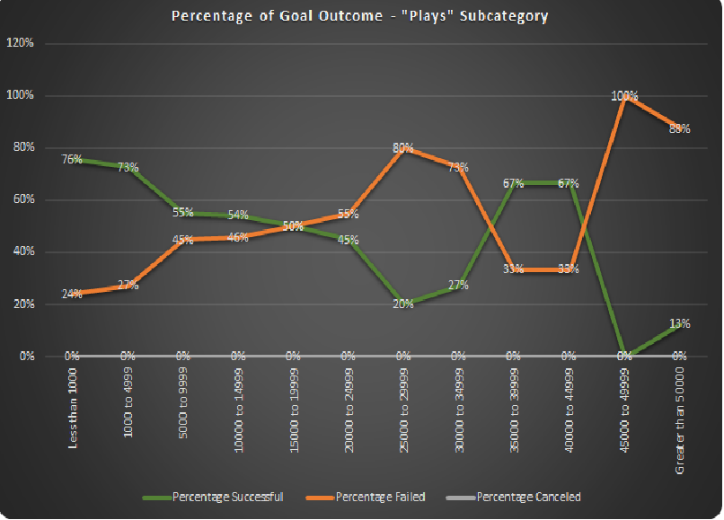
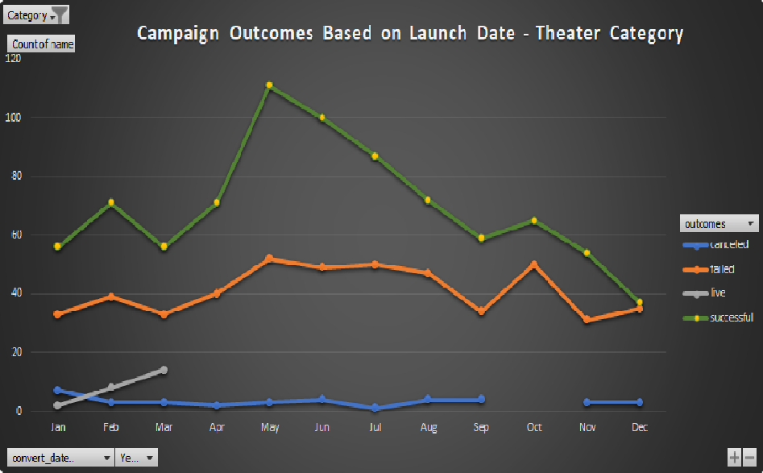

# kickstarter-analysis
Performing analysis on Kickstarter data to uncover trends
### Challenge
Conducting Data analysis to answer a question "How many Kickstarter campaigns were able to come close to its fundraising goal in a short amount of time?", and determine whether the length of a campaign contributes to its ultimate success or failure.
Presenting a cohesive written analysis that:
✓ Draws three reasonable conclusions from the data
✓ States limitations of the dataset and suggestions for additional tables of graphs

